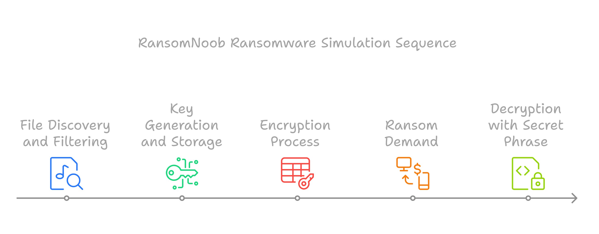

### RansomNoob

---

### Description

**RansomNoob** is a simplified educational demonstration of how ransomware operates, inspired by NetworkChuck's YouTube video ([Watch Here](https://www.youtube.com/watch?v=UtMMjXOlRQc)). This project highlights the fundamental concepts of file encryption and decryption using Python and the **`cryptography`** library. It showcases the importance of secure file handling and the potential dangers of malicious applications. 

This project is strictly for **educational purposes** to better understand encryption processes and should not be used for unethical activities.

---

### Functionality Overview

#### **File Discovery and Filtering**
- The script scans all files in the current directory, excluding itself, the encryption key file, and directories.
- Only individual files are targeted for encryption, ensuring a focused approach.

#### **Key Generation and Storage**
- A unique encryption key is generated using the **`Fernet`** library.
- This symmetric key (used for both encryption and decryption) is saved in a file for later use.

#### **Encryption Process**
- The script encrypts each file using the generated key. 
- Original files are replaced with their encrypted versions, locking the user out of their data.

#### **Ransom Demand**
- After encryption, a message notifies the user about the encryption and demands payment (in Bitcoin) to recover their files.

#### **Decryption with a Secret Phrase**
- A separate decryption script reads the stored encryption key and prompts the user for a secret phrase.
- If the correct phrase is provided, the files are decrypted; otherwise, the files remain inaccessible.

---

### Key Concepts Demonstrated

- **Ransomware Basics**: Understand the mechanics of ransomware, a type of malware that encrypts user files and demands payment for decryption.
- **Symmetric Encryption**: Learn about symmetric encryption, where the same key is used for both encrypting and decrypting data.
- **Fernet (Cryptographic Library)**: Use Python's cryptography library to handle encryption and decryption tasks securely.
- **File I/O Operations**: Work with Python's file handling functions to read, write, and modify files.


---

### Requirements

1. **Python 3.6 or later**
2. **`cryptography` library**

---

### Installation

1. Clone the repository:
   ```bash
   git clone https://github.com/Mr-hunt-007/ransomnoob.git
   cd ransomnoob
   ```

2. Install dependencies:
   ```bash
   pip3 install cryptography
   ```

---

### Usage

1. **Encrypt Files**:  
   Run `encrypt.py` to encrypt files in the current directory.
   ```bash
   python encrypt.py
   ```

2. **Decrypt Files**:  
   Run `decrypt.py` to decrypt files. Enter the correct secret phrase when prompted.
   ```bash
   python decrypt.py
   ```

---

### Example Output

#### Encryption:
```plaintext
['example.txt', 'notes.docx']
Bye Bye
```

#### Decryption:
```plaintext
Enter the secret phrase to decrypt your files
I am Ironman
Congrats, Your files are decrypted
```

---

### Warning ⚠️

This project is a simplified representation of ransomware and is intended solely for educational purposes. Real-world ransomware is far more sophisticated. It is **illegal** and **unethical** to use such code for malicious purposes. Always respect cybersecurity laws and guidelines.

---

### Courtesy  
This project was inspired by NetworkChuck's YouTube video:  
**"[How Hackers Use Python to Create Ransomware](https://www.youtube.com/watch?v=UtMMjXOlRQc)"**.  

---

### Files

- **`encrypt.py`**: Script to encrypt files.
- **`decrypt.py`**: Script to decrypt files.
- **`thekey.key`**: Generated encryption key file.

---


Happy H@cK!n9
